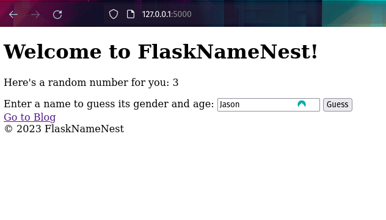
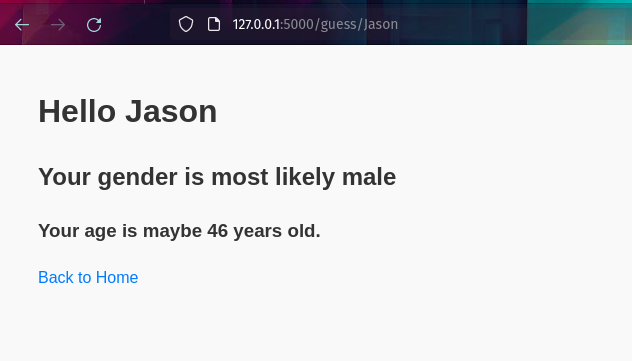

# Flask Name Nest

A simple Flask web application that showcases blog posts, provides a fun guessing game based on names, and displays
random numbers.


## Features

- Display a random number and the current year on the home page.
- Input a name and guess its gender and approximate age.
- View and navigate through a list of blog posts fetched from a local JSON file.
- Easily navigate back to the home page from any route.

## Installation and Setup

1. Clone the repository:

```
git clone https://github.com/j-breedlove/flask_name_nest.git
```

2. Navigate to the project directory and install `pipenv` if you haven't already:
```
cd flask_name_nest
```

```
pip install pipenv
```

3. Use `pipenv` to create a new virtual environment and install the required packages:

```
pipenv install flask requests

```

4. Activate the virtual environment:
```
pipenv shell
```

5. Run the application:
```
python app.py
```
6. Visit `http://127.0.0.1:5000/` in your browser to access the app.

## APIs Used

- [Genderize.io](https://genderize.io/) - To guess the gender based on a name.
- [Agify.io](https://agify.io/) - To guess the approximate age based on a name.

## Styling

The application uses custom CSS for styling. The styles can be found in the `styles` directory off the root, in the `app_styles.css` file.

## License

MIT License. See the [LICENSE](LICENSE) file for details.
